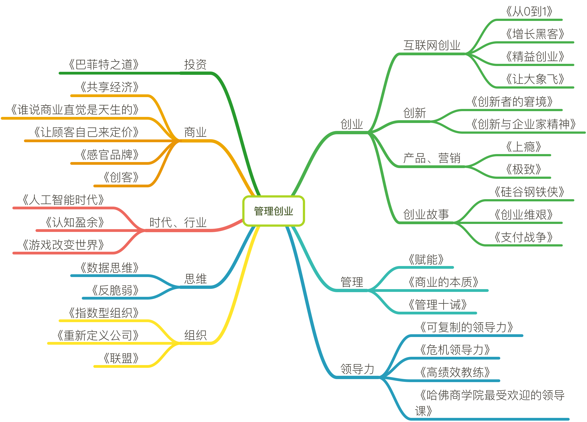

# 管理创业

## 创业

### 互联网创业

- 《从0到1》

- [《增长黑客》](chuangye/增长黑客.md)

- [《精益创业》](chuangye/精益创业.md)

- 《让大象飞》

### 创新

- 《创新者的窘境》

- 《创新与企业家精神》

### 产品、营销

- 《上瘾》

- 《极致》

### 创业故事

- 《硅谷钢铁侠》

- 《创业维艰》

- 《支付战争》

## 管理

- [《赋能》](chuangye/赋能.md)

- 《商业的本质》

- 《管理十诫》

## 领导力

- 《可复制的领导力》

- 《危机领导力》

- 《高绩效教练》

- 《哈佛商学院最受欢迎的领导课》

## 组织

- 《指数型组织》

- 《重新定义公司》

- 《联盟》

## 投资

- 《巴菲特之道》

## 思维

- [《数据思维》](chuangye/数据思维.md)

- [《反脆弱》](chuangye/反脆弱.md)

## 时代、行业

- 《人工智能时代》

- 《认知盈余》

- 《游戏改变世界》

## 商业

- 《共享经济》

- 《谁说商业直觉是天生的》

- 《让顾客自己来定价》

- 《感官品牌》

- 《创客》

