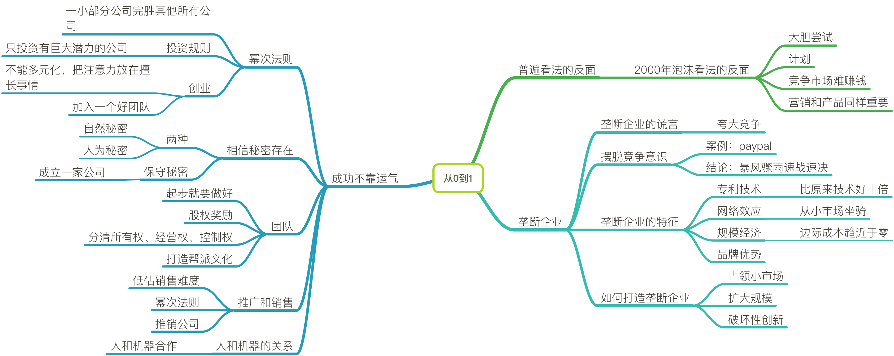

# 从0到1

### 普遍看法的反面

- 2000年泡沫看法的反面

   - 大胆尝试

   - 计划

   - 竞争市场难赚钱

   - 营销和产品同样重要

### 垄断企业

- 垄断企业的谎言

   - 夸大竞争

- 摆脱竞争意识

   - 案例：paypal

   - 结论：暴风骤雨速战速决

- 垄断企业的特征

   - 专利技术

       - 比原来技术好十倍

   - 网络效应

       - 从小市场做起

   - 规模经济

       - 边际成本趋近于零

   - 品牌优势

- 如何打造垄断企业

   - 占领小市场

   - 扩大规模

   - 破坏性创新

### 成功不靠运气

- 幂次法则

   - 一小部分公司完胜其他所有公司

   - 投资规则

       - 只投资有巨大潜力的公司

   - 创业

       - 不能多元化，把注意力放在擅长事情

       - 加入一个好团队

- 相信秘密存在

   - 两种

    + 自然秘密

    + 人为秘密

   - 保守秘密

       - 成立一家公司

- 团队

   - 起步就要做好

   - 股权奖励

   - 分清所有权、经营权、控制权

   - 打造帮派文化

- 推广和销售

   - 低估销售难度

   - 幂次法则

   - 推销公司

- 人和机器的关系

   - 人和机器合作

