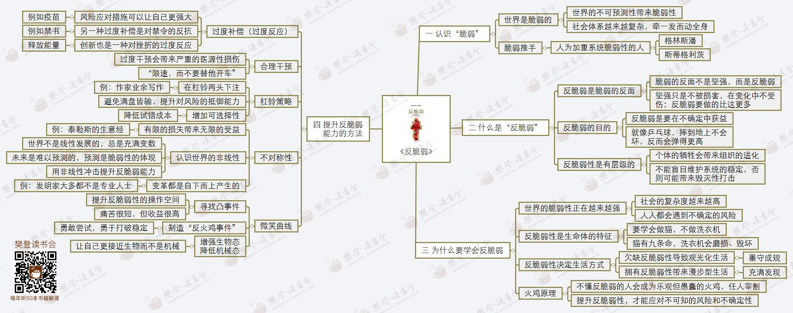

# 反脆弱

## 认识脆弱
### 世界是脆弱的
- 世界的不可预测性带来脆弱性
- 社会体系越来越复杂，牵一发而动全身
### 脆弱推手
#### 人为加重系统脆弱性的人
- 格林斯潘
- 斯蒂格利茨

## 什么是反脆弱
### 反脆弱的反面
- 脆弱的反面不是坚强，而是反脆弱
- 坚强只是不被损害，在变化中不受伤，反脆弱要做得比这更多
### 反脆弱的目的
- 反脆弱是要在不确定中获益
- 就像乒乓球，摔到地上不会坏，反而会弹得更高
### 反脆弱是有层级的
- 个体的牺牲会带来组织的进化
- 不能盲目维护系统的稳定，否则会带来毁灭性打击

## 为什么要学会反脆弱
### 世界的脆弱性正在越来越强
- 社会的复杂度越来越高
- 人人都会遇到不确定的风险
### 反脆弱性是生命体的特征
- 要学会做猫，不做洗衣机
- 猫有九条命，洗衣机会磨损、毁坏
### 反脆弱性决定生活方式
- 欠缺反脆弱性导致观光化生活
    + 墨守成规
- 拥有反脆弱性带来漫步型生活
    - 充满发现
### 火鸡原理
- 不懂反脆弱的人会成为乐观但愚蠢的火鸡，任人宰割
- 提升反脆弱性，才能应对不可知的风险和不确定性

## 提升反脆弱能力的方法
### 过度补偿
#### 风险应对策略可以让自己更强大
- 例如疫苗
#### 另一种过度补偿是对抗禁令的反抗
- 例如禁书
### 创新也是一种对抗挫折的过度反应
- 释放能量
### 合理干预
- 过度干预会带来严重的医源性损伤
- 限速，而不要替他开车
### 杠杆策略
- 在杠铃两头下注
    + 作家业余写作
- 避免满盘皆输，提升对抗风险抵御能力
- 增加可选性
    - 降低试错成本
### 不对称性
- 有限的损失带来无限的收益
    - 泰勒的生意经
- 认识世界的非线性
    - 世界不是线性发展的，总是充满变数
    - 未来是难以预测的，预测是脆弱性的体现
    - 用非线性冲击提升反脆弱能力
- 变革都是自下而上产生的
    - 发明家大多都不是专业人士
### 微笑曲线
- 寻找凸事件
    + 提升反脆弱性的操作空间
    + 痛苦很短，但收益很高
- 制造反火鸡事件
    - 勇敢尝试，勇于打破稳定
- 增强生物态，降低机械态
    - 让自己更接近生物而不是机械
