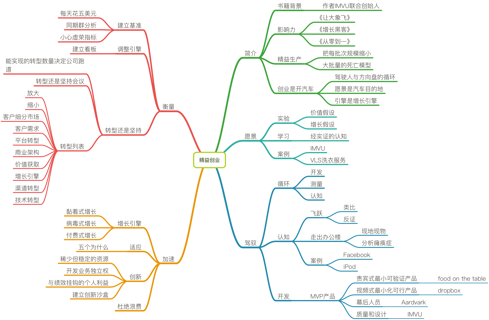

# 精益创业

## 简介

### 书籍背景

- 作者IMVU联合创始人

### 影响力

- 《让大象飞》

- 《增长黑客》

- 《从零到一》

### 精益生产

- 把每批次规模缩小

- 大批量的死亡模型

### 创业是开汽车

- 驾驶人与方向盘的循环

- 愿景是汽车目的地

- 引擎是增长引擎

## 愿景

### 实验

- 价值假设

- 增长假设

### 学习

- 经实证的认知

### 案例

- IMVU

- VLS洗衣服务

## 驾驭

### 循环

- 开发

- 测量

- 认知

### 认知

- 飞跃
    + 类比
    + 反证

- 走出办公楼
    + 现地现物
    + 分析瘫痪症

- 案例
    - Facebook
    - iPod

### 开发

- MVP产品

- 贵宾式最小可验证产品

	- food on the table

- 视频式最小化可行产品

	- dropbox

- 幕后人员

	- Aardvark

- 质量和设计

	- IMVU

## 加速

### 增长引擎

- 黏着式增长

- 病毒式增长

- 付费式增长

### 适应

- 五个为什么

### 创新

- 稀少但稳定的资源

- 开发业务独立权

- 与绩效挂钩的个人利益

- 建立创新沙盒

### 杜绝浪费

## 衡量

### 建立基准

- 每天花五美元

- 同期群分析

- 小心虚荣指标

### 调整引擎

- 建立看板

### 转型还是坚持

- 能实现的转型数量决定公司跑道

- 转型还是坚持会议

- 转型列表
    - 放大

    - 缩小

    - 客户细分市场

    - 客户需求

    - 平台转型

    - 商业架构

    - 价值获取

    - 增长引擎

    - 渠道转型

    - 技术转型

