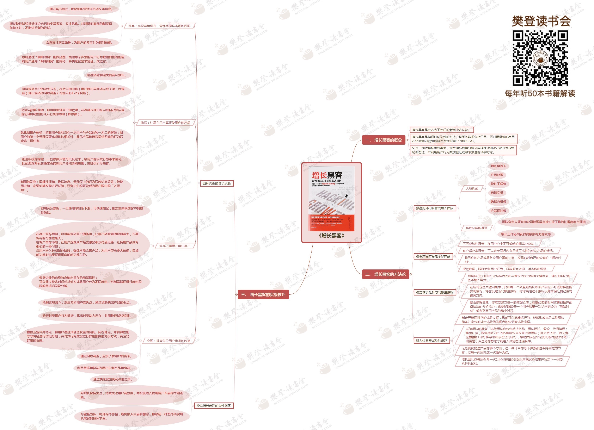

# 增长黑客

## 增长黑客的概念

- 增长黑客是硅谷当下热门的新商业方法论
- 增长黑客是指通过创造性的方法、科学的数据分析工具，可以用极低的费用在极短时间内吸引数以百万计的用户的增长方法
- 它是一种依赖技术新渠道、大数据与数据分析来实现快速测试产品开发&营销的新想法，并利用用户行为数据验证或寻求演进的科学方法

## 增长黑客的方法论
### 搭建跨部门合作的增长团队
#### 人员构成
- 增长负责人
- 产品经理
- 软件工程师
- 营销专员
- 数据分析师
- 产品设计师

#### 其他必要的准备
- 团队负责人须有向公司管理层直接汇报工作的汇报制度与通道
- 增长工作必须获得高层强有力的支持
### 确保产品本身是个好产品
- 不可或缺调查：在用户心中不可或缺的概率>=40%
- 客户留存率调查：可以参考同行内有足够可比性的成功产品的情况
- 找到你得产品或服务令用户眼前一亮，发现它对自己的价值的“啊哈时刻”
- 深挖数据，跟踪活跃用户行为，以数据位依据，适当做出调整

### 确定增长杠杆与北极星指标
- 根据自己企业的行为与特点找出与增长相关的所有关键因素，建立你自己的基本增长等式
- 在所有关键因素中，找出哪个变量最能反映产品不可或缺体验的情况，将它设为北极星指标，关注此指标保证没有偏离方向
- 整合数据资源：建立统一数据仓库，收集数据并配备恰当的分析能力，需要能跟踪每个用户从第一次访问到经历“啊哈时刻”或者放弃的整个过程

### 进入快节奏试验的循环

- 制定严格而科学的试验过程，形成可以流畅运行的、能够形成充足试验想法并高效排定试验优先顺序的快节奏试验流程
- 试验想法的准备：试验想法包含想法名称、描述、假设、待测指标；收集团队内外各种建议来改善想法；提交想法时，提交者应根据ICE评分体系给出该想法评分
- 无论测试是产品哪个方面，这一循环中每个不走都应保持固定的节奏，一两周完成一次循环为佳
- 增长团队应每周召开一次1小时左右会议审视试验结果并决定下周要执行的试验

## 增长黑客的实战技巧

### 四种类型的增长试验

#### 获客：试验营销语言、营销渠道与市场的匹配

- 通过A/B测试，优化营销语言或文本信息
- 通过快速试验筛选适合自己的少量渠道、专注优化、并对随时涌现的新渠道保持关注，不断进行新的尝试
- 合理设计病毒循环，为用户分享行为找到价值

#### 激活：让潜在用户真正使用你的产品
- 绘制通往“啊哈时刻”路线图，找到阻碍用户“啊哈时刻”障碍，快速试验验证、改进
- 创建转化和流失的漏斗报告
- 根据用户流失节点，在适当时机，弹出简洁问卷调查
- 转化=欲望-摩擦
- 优化新用户体验
- 创造积极的摩擦
- 利用触发物

#### 留存：唤醒并留住用户
- 密切关注数据
- 初期：优化用户体验
- 中期：让产品成为习惯
- 长期：增加新功能
- 确定留存衡量指标，分群组跟踪

#### 变现：提高美味用户带来的收益

- 根据创造收益高低，地点、年龄、性别等分组跟踪分析
- 调查问卷了解用户需求
- 利用数据和算法为用户定制产品
- 通过快速试验优化定价

### 避免增长停滞的良性循环

- 对增长保持关注，持续关注用户满意度，并积极去发现用户不满的早期迹象
- 与鲨鱼为伍，时刻保持警惕，避免陷入自满与懈怠，像最初一样坚持落实增长黑客循环节奏

