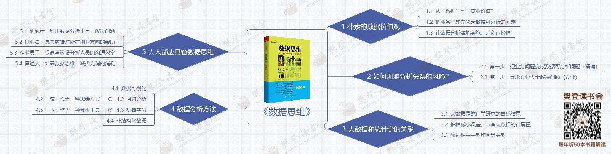

# 数据思维

## 朴素的数据价值观

- 从数据到商业价值
- 把业务问题定义为数据可分析的问题
- 让数据分析落地实施，并创造价值

## 如何规避分析失误的风险

- 把业务问题变成数据可分析问题（精确）
- 寻求专业人士解决问题

## 大数据和统计学的关系

- 大数据是统计学研究自然结果
- 抽样减少误差，节省大数据的计算量
- 甄别相关关系和因果关系

## 数据分析方法

- 数据可视化
- 回归分析
- 机器学习
- 非结构化数据

## 人人都应具备数据思维

- 研究者：利用数据分析工具，解决问题
- 创业者：思考数据对所在创业方向的帮助
- 企业员工：提高与数据分析人员沟通效率
- 普通人：培养数据思维，减少无谓消耗

