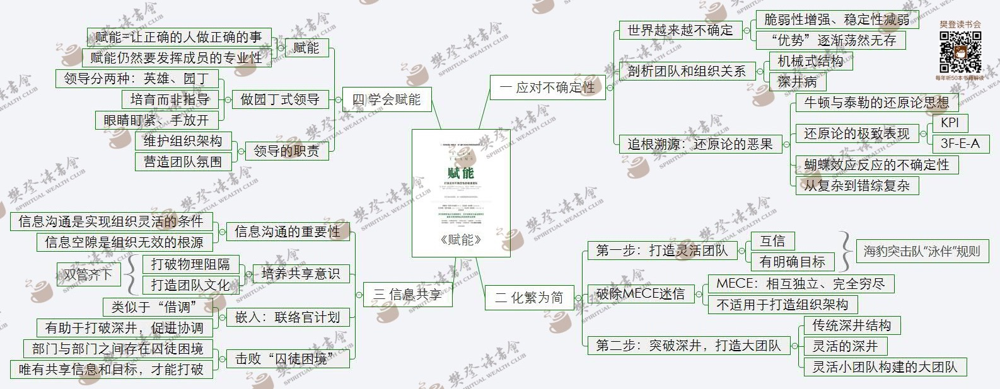

# 赋能

## 应对不确定性
- 世界越来越不确定
	- 脆弱性增强、稳定性减弱
	- 优势逐渐荡然无存
- 剖析团队和组织关系
	- 机械式结构
	- 深井病
- 追根溯源：还原论的恶果
	- 牛顿与泰勒的还原论思想
	- 还原论的极致表现
		- KPI
		- 3F-E-A
	- 蝴蝶效应反应的不确定性
	- 从复杂到错综复杂

## 化繁为简
- 打造灵活团队
	- 互信
	- 有明确目标
- 破除MECE迷信
	- MECE：相互独立、完全穷尽
	- 不适用于打造组织结构
- 突破深井，打造大团队
	- 传统深井结构
	- 灵活的深井
	- 灵活小团队构建的大团队
 
## 信息共享
- 信息沟通的重要性
	- 信息沟通是实现组织灵活的条件
	- 信息空隙是组织无效的根源
- 培养共享意识
	- 打破物理阻隔
	- 打造团队文化
- 嵌入：联络官计划
	- 类似于“借调”
	- 有助于打破深井，促进协调
- 击败“囚徒困境”
	- 部门与部门间存在囚徒困境
	- 唯有共享信息和目标，才能打破

## 学会赋能
- 赋能
	- 让正确的人做正确的事
	- 仍然要发挥成员的专业性
- 做园丁式领导
	- 英雄、园丁
	- 培育而非指导
	- 眼睛盯紧、手放开
- 领导的职责
	- 维护组织架构
	- 营造团队氛围

