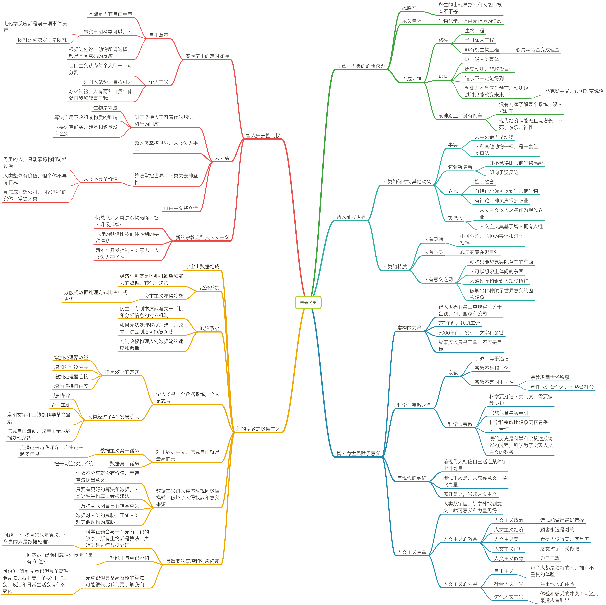

# 未来简史

## 序章：人类的的新议题

- 战胜死亡

   - 永生的出现导致人和人之间根本不平等

- 永久幸福

   - 生物化学，提供无止境的快感

- 人成为神

   - 路径

      - 生物工程

      - 半机械人工程

      - 非有机生物工程

	      - 心灵从碳基变成硅基

   - 澄清

      - 以上说人类整体

      - 历史预测，非政治目标

      - 追求不一定能得到

      - 预测并不是成为预言，预测经过讨论能改变未来

	      - 马克斯主义，预测改变统治

   - 成神路上，没有刹车

      - 没有专家了解整个系统，没人能刹车

      - 现代经济职能无止境增长，不死、快乐、神性

## 智人征服世界

- 人类如何对待其他动物

   - 事实

      - 人类灭绝大型动物

      - 人和其他动物一样，是一套生物算法

   - 狩猎采集者

      - 并不觉得比其他生物高级

      - 倾向于泛灵论

   - 农民

      - 控制牲畜

      - 有神论承诺可以剥削其他生物

      - 有神论，神负责保护农业

   - 现代人

      - 人文主义以人之名作为现代农业

      - 人文主义奠基于智人拥有人性

- 人类的特质

   - 人有灵魂

      - 不可分割、永恒的实体和进化相悖

   - 人有心灵

      - 心灵究竟在哪里？

   - 人有意义之网

      - 动物只能想象实际存在的东西

      - 人可以想象主体间的东西

      - 人通过虚构组织大规模协作

      - 破解出种种赋予世界意义的虚构想象

## 智人为世界赋予意义

- 虚构的力量

   - 智人世界有第三重现实，关于金钱、神、国家和公司

   - 7万年前，认知革命

   - 5000年前，发明了文字和金钱

   - 故事应该只是工具，不应是目标

- 科学与宗教之争

   - 宗教

      - 宗教不等于迷信

      - 宗教不是超自然

      - 宗教不等同于灵性

	      - 宗教巩固世俗秩序

	      - 灵性只适合个人，不适合社会

   - 科学与宗教

      - 科学要打造人类制度，需要宗教协助

      - 宗教包含事实声明

      - 科学和宗教比想象更容易妥协、合作

      - 现代历史是科学和宗教达成协议的过程，科学为了实现人文主义的教条

- 与现代的契约

   - 前现代人相信自己活在某种宇宙计划里

   - 现代本质是，人放弃意义，换取力量

   - 离开意义，兴起人文主义

- 人文主义革命

   - 人类从宇宙计划之外找到意义，就可意义和力量见得

   - 人文主义的教条

      - 人文主义政治

	      - 选民能做出最好选择

      - 人文主义经济

	      - 顾客永远是对的

      - 人文主义美学

	      - 看得人觉得美，就是美

      - 人文主义伦理

	      - 感觉对了，就做吧

      - 人文主义教育

	      - 为自己想

   - 人文主义的分裂

      - 自由主义

	      - 每个人都是独特的人，拥有不重复的体验

      - 社会人文主义

	      - 注重他人的体验

      - 进化人文主义

	      - 体验和感受的冲突不可避免，最适应者胜出

## 智人失去控制权

- 实验室里的定时炸弹

   - 自由意志

      - 基础是人有自由意志

      - 事实声明科学可以介入

	      - 电化学反应都是前一项事件决定

	      - 随机运动决定，是随机

      - 根据进化论，动物所谓选择，都是基因密码的反应

   - 个人主义

      - 自由主义认为每个人单一不可分割

      - 列闹人试验，自我可分

      - 冰火试验，人有两种自我：体验自我和叙事自我

- 大分离

   - 对于坚持人不可替代的想法，科学的回应

      - 生物是算法

      - 算法作用不收组成物质的影响

      - 只要运算确实，硅基和碳基没有区别

   - 超人类掌控世界，人类失去平等

   - 算法掌控世界，人类失去神圣性

      - 人类不具备价值

	      - 无用的人，只能靠药物和游戏过活

	      - 人类整体有价值，但个体不再有权威

	      - 算法成为想公司、国家那样的实体，掌握人类

   - 自由主义将崩溃

- 新的宗教之科技人文主义

   - 仍然认为人类是造物巅峰，智人升级成智神

   - 心理的频谱比我们体验到的要宽得多

   - 两难：开发控制人类意志，人类失去神圣性

## 新的宗教之数据主义

- 宇宙由数据组成

- 经济系统

   - 经济机制就是收银机欲望和能力的数据，转化为决策

   - 资本主义赢得冷战

      - 分散式数据处理方式比集中式更优

- 政治系统

   - 民主和专制本质两套关于手机和分析信息的对立机制

   - 如果无法处理数据，选举、政党、过会制度可能被淘汰

   - 专制政权物理应对数据流的速度和数量

- 全人类是一个数据系统，个人是芯片

   - 提高效率的方式

      - 增加处理器数量

      - 增加处理器种类

      - 增加处理器连接

      - 增加连接自由度

   - 人类经过了4个发展阶段

      - 认知革命

      - 农业革命

      - 发明文字和金钱到科学革命肇始

      - 信息自由流动，改善了全球数据处理系统

- 对于数据主义，信息自由就是最高的善

   - 数据主义第一诫命

      - 连接越来越多媒介，产生越来越多信息

   - 数据第二诫命

      - 把一切连接到系统

- 数据主义讲人类体验视同数据模式，破坏了人得权威和意义来源

   - 体验不分享就没有价值，等待算法找出意义

   - 只要有更好的算法和数据，人类这种生物算法会被淘汰

   - 万物互联网自己有神圣意义

   - 数据对人类的威胁，正如人类对其他动物的威胁

- 最重要的事项和对应问题

   - 科学正聚合与一个无所不包的胶条，所有生物都是算法，声明则是进行数据处理

      - 问题1：生物真的只是算法，生命真的只是数据处理？

   - 智能正与意识脱钩

      - 问题2：智能和意识究竟哪个更有 价值？

   - 无意识但具备高智能的算法，可能很快比我们更了解我们

      - 问题3：等到无意识但具备高智能算法比我们更了解我们，社会、政治和日常生活会有什么变化

