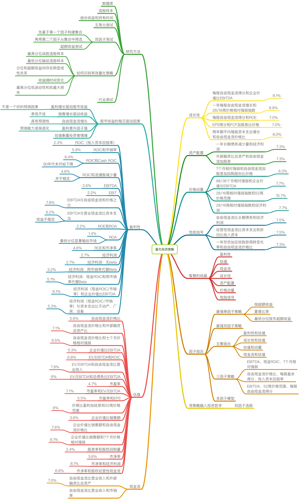

# 量化投资策略

## 成长性

- 每股自由现金流得分和企业价值比EBITDA

   - 8.1%

- 一年每股自由现金流增长和28/16周价格相对强弱指数

   - 8.9%

- 每股自由现金流得分和ROE

   - 7.0%

- EPS得分和FCF加股息比价格

   - 7.0%

- 两年期平均每股资本支出增长和自由现金流价格比

   - 8.0%

## 资产配置

- 一年长期债务减少量和经济利润

   - 7.3%

- 外部融资比总资产和自由现金流加股息

   - 7.3%

## 价格动量

- 7个月相对强弱和自由现金流加股息加回购股份比价格

   - 8.3%

- 88/36个月相对强弱和企业价值与EBITDA

   - 7.7%

- 28/16周相对强弱指数和52周价格范围

   - 10.7%

- 28/16周相对强弱指数和经济利润

   - 7.7%

## 危险信号

- 自由现金流比长期债务和经济利润

   - 7.5%

- 经营性现金流比资本支出和折旧比投入资本

   - 7.5%

- 一年存货加应收账款周转变化率和自由现金流价格比

   - 7.3%

## 智慧的结晶

- 盈利性

- 估值

- 现金流

- 成长性

- 资产配置

- 价格动量

- 危险信号

## 因子组合

- 最强单因子策略

   - 按超额收益

   - 夏普比率

   - 最低分位按负超额收益

- 最强双因子策略

- 主要组合

   - 盈利性和估值

   - 成长性和估值

   - 估值和动量

   - 现金流和估值

- 三因子策略

   - EBITDA、现金ROIC、7个月相对强弱

   - 自由现金流价格比、每股盈余得分、投入资本回报率

   - EBITDA、52周价格范围、每股自由现金流得分

- 多因子模型

## 将策略融入投资哲学

- 双因子选股

## 现金流

- 自由现金流比营业收入和外部融资比总资产

   - 7.0%

- 自由现金流比营业收入和市销率

## 估值

- 自由现金流价格比

   - 5.6%

- 自由现金流价格比和外部融资总资产比

   - 7.1%

- 自由现金流价格比和七个月价格相对强弱

   - 9.5%

- 企业价值比EBITDA

   - 5.3%

- EV/EBITDA和ROIC

   - 6.8%

- EV/EBITDA和自由现金流比营业收入

   - 7.9%

- EV/EBITDA和总债务比EBITDA

   - 6%

- 市盈率

   - 4.7%

- 市盈率和EV/EBITDA

   - 7.1%

- 市盈率和EPS

   - 5.5%

- 价格比盈利加姑息和52周价格范围

   - 6%

- 企业价值比销售额

   - 3.6%

- 企业价值比销售额和自由现金流价格比

   - 7.6%

- 企业价值比销售额和7个月价格相对强弱

   - 6.1%

- 股息率和股权回购量

   - 2.4%

- 市净率

   - 3.6%

- 市净率和经济利润

   - 8.1%

- 市净率和股权经营性现金流

   - 6.6%

## 盈利性

- ROIC（投入资本回报率）

   - 2.3%

- ROIC和市销率

   - 5.9%

- ROIC和Cash ROIC

   - 8.4%

   - 90年代末开始下降

- ROIC和流通股减少量

   - 4.6%

   - 并不稳定

- EBITDA

   - 2.6%

- EBIT

   - 2.2%

- EBITDA与自由现金流和价格之比

   - 7.8%

- EBITDA与营业现金流比资本支出

   - 6.2%

   - 收益不稳定

- ROE和ROA

   - 2.2%

- ROA

   - 1.4%

   - 最低分位显著输给市场

- ROE和市净率

   - 4.6%

- 经济利润

   - 2.7%

- 经济利润：无beta

   - 2.7%

- 经济利润：用市销率代替Beta

   - 3.2%

- 经济利润：现金ROIC和用市销率代替Beta

   - 5.1%

- 经济利润（现金ROIC/市销率）和企业价值比EBITDA

   - 8.1%

- 经济利润（现金ROIC/市销率）与资本支出比不动产、厂房、设备

   - 5.3%

## 股市收益的每日驱动因素

- 盈利增长驱动股市收益

   - 不是一个好的预测因素

- 销售增长驱动收益

   - 表现不佳

- 自由现金流增长

   - 具有预测性

- 盈利意外因子值

   - 预测能力逐渐退化

- 估值衡量投资者情绪

## 研究方法

- 数据库

- 选股样本

- 组合收益和持有时间

- 五等分测试

- 双因子测试

   - 先基于第一个因子构建集合

   - 再用第二个因子从集合中筛选

   - 超额收益测试

- 如何识别有效量化策略

   - 最高分位战胜选股样本

   - 最低分位输给选股样本

   - 分位和超额收益间存在明显线性关系

   - 收益随时间变化

   - 最高分位低波动性和低最大损失

- 行业测试

