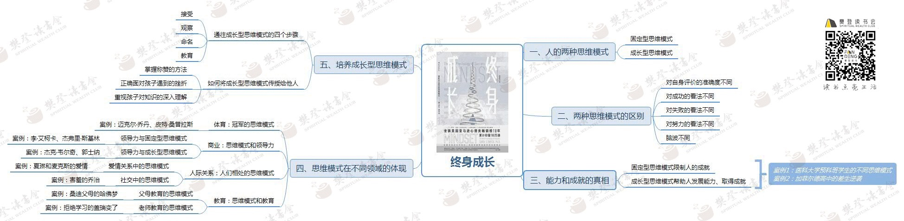

# 终身成长

## 人的两种思维模式
- 固定型思维
- 成长型思维

## 两种思维模式的区别

- 对自身评价准确度不同
- 成功看法不同
- 失败开发不同
- 努力看法不同
- 脑波不同

## 能力和成就的真相

- 固定型思维模式限制人的成就
- 成长型思维模式帮助人发展能力、取得成就

## 思维模式在不同领域的体现

### 体育
- 冠军的思维模式
- 案例：乔丹、桑普拉斯

### 商业
- 领导力与固定型思维模式
    - 李·艾克卡（福特汽车）：城堡办公
    - 杰弗里·斯基林 
- 领导力与成长型思维模式
    - 杰克·韦尔奇
    - 郭士纳

### 人际关系
- 爱情关系
    - 夏玲和麦克斯的爱情:落跑新郎
- 社交
    - 害羞的乔治

### 教育
- 父母教育
    - 桑迪父母的哈佛梦
- 老师教育的思维模式
    - 拒绝学习的盖瑞变了  

## 培养成长型思维模式
### 通往成长型思维模式的四个步骤
- 接纳
- 观察
- 行为  
- 寻找亮点
### 如何将成长型思维模式传授给他人
- 掌握称赞的方法
- 正确面对孩子遇到的挫折
- 重视孩子对知识的深入理解

