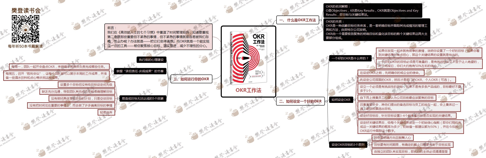

# OKR工作法

## 什么是OKR工作法
-  O：Objective
- KR：Key result

## 本质
- 战略目标任务体系
- 组成
    - 一个需要极致聚焦明确目标
    - 量化该目标的数个关键结果

## 如何设定一个好的OKR
### 一个好的OKR
- 好目标
    - 起床有目标
- 关键结果
    - 可衡量
    - 有挑战又不至于让人绝望

### 如何设定OKR

- 明确企业使命
- 先设定公司层面OKR、部门、个人
- 挑战性，不要多于1个
- 自下而上搜集
- 召集高管会议，把备选目标过一遍，投票表决
- 针对目标设置3~4个关键结果
- 给每个关键结果设置信心指数，并且跟踪这一数字

### 设定OKR目标的3原则
- 目标明确方向且鼓舞人心
- 目标要有时间期限，截止日期要助于目标实现
- 由独立团队来实现目标，执行主体明确

## 如何运行你的OKR
### 执行前的心理建设
### 掌握承担责任-庆祝成果的节奏

- 每周一，团队开会盘点OKR
- 周五，召开胜利会议，让团队展示本周工作成果

### 易造成目标无法达成的5个因素

